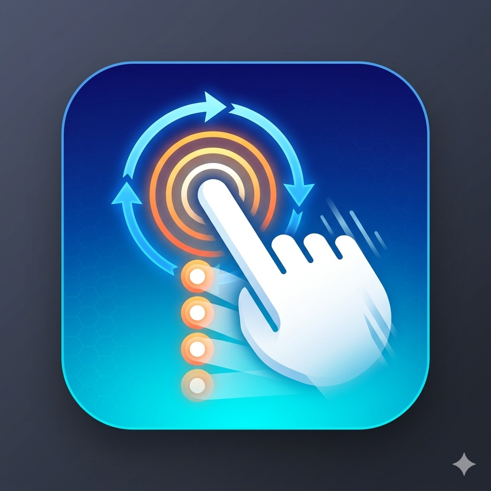

# SynapseClick - The Ultimate Android Auto-Clicker ⚡

  

**SynapseClick** (often searched as *Synapse Click*) is a fast, highly-customizable, and lightweight **Auto-Clicker for Android devices**. Whether you're grinding in a mobile game that requires endless tapping or you just need a macro to automate repetitive screen tasks on your phone, the official SynapseClick app can handle it perfectly!

*If you are searching for the official SynapseClick Android deployment, you are in the right place!*

## 🚀 What the SynapseClick App Does
* **Unlimited Auto Clicks & Swipes:** You can add as many tap and swipe actions as you want to your screen. The SynapseClick engine will perform all of them in order automatically.
* **Floating Control Menu:** The controls float right on top of your screen! You can drag the menu around wherever you need it, or collapse it into a tiny bar so it stays completely out of your way while you use other apps.
* **Smooth Human-Like Swipes:** The app automatically calculates the exact distance for your swipes so they scroll perfectly smooth across any Android screen, mimicking a natural human finger natively.
* **Custom Macro Timers:** You have total control over the speed! You can set exactly how long the app waits between each tap, and how long to wait before the whole sequence restarts.

## 📱 Required Permissions (Setup)
To make the auto-clicker work properly, Android requires you to explicitly allow SynapseClick two specific permissions. When you open the configuration screen, you will need to click the buttons to turn these on in your device Settings:

1. **Accessibility Service:** This is the most important permission. It is what actually allows SynapseClick to simulate tapping and swiping the screen on your behalf. *(Note: We only use this permission to perform the clicks you ask for!)*
2. **Draw Over Other Apps (Overlay):** This permission allows our floating control menu to stay visible on top of your screen while you are inside your games or other apps.

## 📥 How to Install SynapseClick
Simply download the latest `app-release.apk` file from the **Releases** tab on the right side of this GitHub repository page and install the Auto-Clicker directly onto your Android device!
